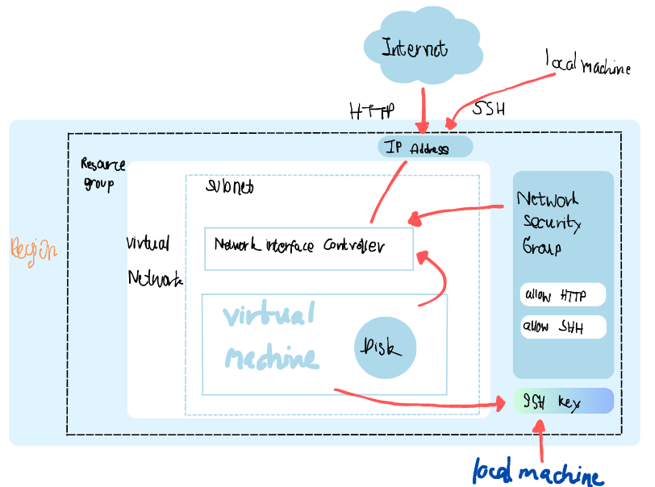

# Tech241_azure

## What is cloud?
The on demand delivery of resources over the internet with pay as you go pricing.

**Advantages of cloud**
* Cost efficiency depends on organisation
* Economy scale
* High reliability

**Disadvantages of cloud**
* Shared security responsibility
* Limit control
* Internet dependency

## Types of Cloud
1) **Public cloud:** multi-tenant cloud where sharing cloud with the rest of the public.
2) **Private cloud:** single-tenant cloud where services are provided either over the internet or private network and only selected users are allowed to access.
3) **Hybrid cloud:** combination of Public and Private cloud
4) **Multi cloud:** when an organisation uses more than one cloud providers to run their applications

## Types of Cloud Services
1) On-Premises
2) Infrastructure as a Service
3) Plaform as a Service
4) Software as a Service 

## Azure

#### Management levels
* Management groups: helps managing access, policy and complience for subscriptions
* Subscriptions: organisation uses subscriptions to manage costs
* Resource groups: containers where resources would be contained in 
* Resources: instances of services
  

## What is virtualisation?
Virtualisation is a the process of creating a virtual version of a physical resources.

## what is virtual machine? Where can they be run? 
virtual machine is a compute resource that uses virsualisation software instead of a physical computer. 

Virtual machines can run on various platforms including:
* on-premises data center 
* Public cloud providers
* Private cloud providers

## What determines how many can run?
The numbers of virtual machines can run depends on many factors such as the workload requirements of each VM, hardware resources: CPU, RAM or storage. Also, the capabitilies and limitations of the virtualisation software.

## What does a virtual machine include?
A typical VM usually includes:
* **Virtualise hardware** components such as virtual CPU, storage, RAM
* **Operating system** such as Linux, Windows or MacOS
* **Applications and services**
  
## What software is required to orchestrate/run the virtual machines?
Hypervisors is virtualisation software which is used to orchestrated and managed virtual machines. Popular hypervisor software includes VMware vSphere, Microsoft Hyper-V and Citrix Hypervisor. The software provides the functionality to create, configure, manage, and monitor virtual machines. 

## What is the importance of an image when creating an VM?
An image is a template which contains an operating system, software and configurations

## Create VM on Azure Diagram

| Title | Description |
| ----------- | ----------- |
| Region | Where everything lives |
| Resource Groups | Like a container to organise everything you have |
| Virtual Network | Like the house |
| Sub Network | Like a room inside a house |
| Virtual machine | like a computer/device in a room |
| Disk | Stores files in the VM |
| Network Interface Controller (NIC) | Communicate with the computer through this |
| IP Address | Your public address |
| Network Security Group (NSG) | Like a security system on the computer |
| NSG rule - allow SSH/ HTTP | Rules to dicide what types of people (traffic) can access computer
| SSH key | Like a padlock on the computer