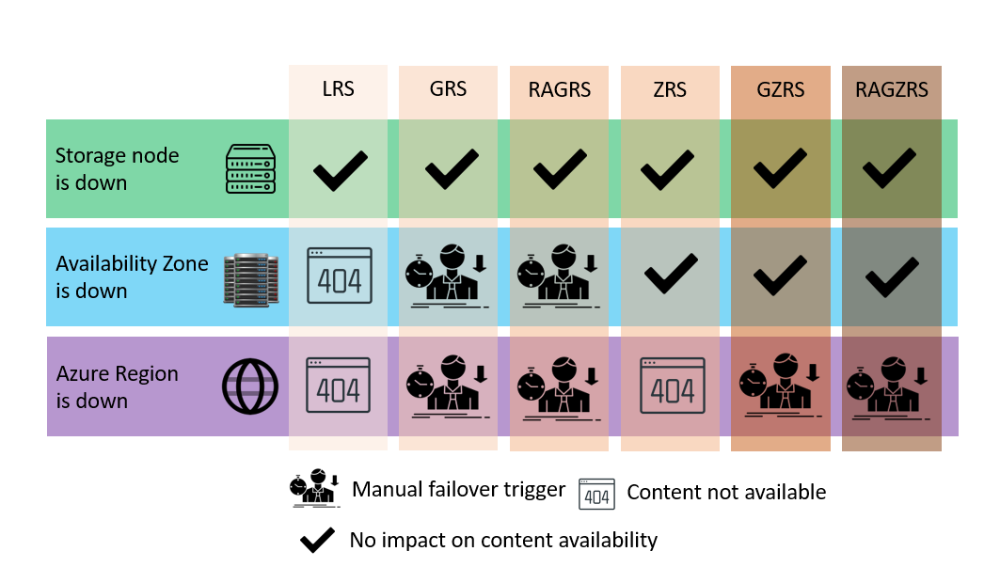

# Blob

### 1) What is blob storage?

Blob storage is a type of cloud storage for unstructured data, blob refers to 'Binary Large OBject'. 

### 2) Difference bewteen blob storage and the file system of Linux/Windows/Mac (hierarchical storage)
The main difference is the underlying architecture and purpose. Blob provides a way to store a massive amount of data. Whereas file system is typically used for managing files and folders. 

### 3) Advantages/disadvantages of blob storage
**Advantage**
* Scalability - you can store large amounts of data and be able to scale up or down as you needs
* Durability and availability - it ensures that you can still access to the storage even in the case of hardware failures.
* Cost-effective - it offers flixible pricing options.

**Disadvantage**
* Limit system file features - lacks of some features such as hierarchical structure, permissions and file metadata
* Network dependency - as a cloud storage service, it relies on network connectivity.

### 4) Different tiers
* Hot access tier - suitable for frequently accessed data and it offers low costs but higher access and transaction costs.
* Cool access tier - suitable for infrequently accessed data with higher latency tolerance. It offers lower storage costs than hot tier but higher access and transaction costs.
* Archive access tier - suitable for long term retention data that is rarely accessed. It offers the lowest storage costs but higher access and retrieval costs with longer retrieval times.

### 5) Parts of Azure blob storage: account, container, blobs - how do they relate?
Account storage can contain multiple containers and each container can contain multiple blobs. This hierarchical structure allows to manage and organise data within Azure blob storage. 

## Types of redundancy
| Types | Description |
| ----------- | ----------- |
| LRS | Store data within a single data centre in a specific region. It is the cheapest but offers the lowest durability and availability. Suitable for non-critical data|
| ZRS | Store data across multiple data centers within a single region. Comparing to LRS, higher durability and availability. Suitable for when higher redundancy and resilience are required within a region. |
| GRS | Store data across a paired regions. It offers higher durability and availability compared to LRS and ZRS. Suitable for when data needs to be protected against regional disasters. |
| RA-GRS | Provides the same redundancy as GRS with additional capability of read access to the replicated data in the secondary region. It allows read access for the second region when the first region fails.|
| GZRS | Provides the benefits of GRS and ZRS. Suitable fot when data is required both zone level and regional level dedundancy. |
| RA-GZRS | Provides the same redundancy as GZRS but with the additional capability of read acccess to the replicated data in the secondary region|

## Azure Storage tiers and availability 
