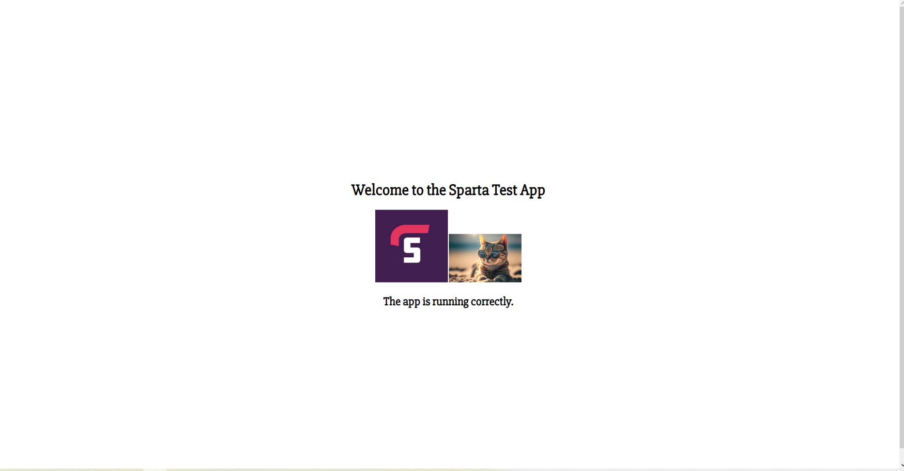

# Blob 

There are different ways to create blob:
* Azure portal
* Azure CLI (command line interface)
* Azure Powershell

To check if azure CLI working on git bash run:
	`az`
Every single command using azure CLI start with `az`

1) To log in
    ```
    az login
    ```
    *When login don’t share anything with id* 

2) To create az storage
    ```
    az storage account create --name tech241parichatstorage --resource-group tech241 --location uksouth --sku Standard_LRS
    ```

3) List storage account
    ```
    az storage account list --resource-group tech241
    ```

    Display in a table
    ```
    az storage account list --resource-group tech241 --query "[].{Name:name, Location:location, Kind:kind}" --output table
    ```

4) Create a container
    ```
    az storage container create --account-name tech241parichatstorage --name testcontainer
    ```

5) Upload a blob
   1) Create a test file 
   2) Run
        ```
        az storage blob upload --account-name tech241parichatstorage --container-name testcontainer --name newname.txt --file test.txt --auth-mode login
        ```

6) Check if the blob is there
    ```
    az storage blob list --account-name tech241parichatstorage --container-name testcontainer --output table --auth-mode login
    ```

7) Change access level

    Azure storage account -> Container -> Change access level -> Change: public access level to *Blob (anonymous read access for blobs only)*


# Add a blob image to the Sparta app 
1) Install azure CLI on vm
   ```
   curl -sL https://aka.ms/InstallAzureCLIDeb | sudo bash
   ```
2) Login to Azure
   ```
   az login
   ```
3) Download an image
   `wget` command used with https
    ```
    wget <url> --output <filename>
    ``` 
    ```
    wget "https://tech241ramonstorage.blob.core.windows.net/catcontainer/uploadedcat.jpg" -O cat.jpg
    ```
4) Upload an image (before this step, you need a storage account and container)
   ```
   az storage blob upload --account-name tech241parichatstorage --container-name testcontainer --name uploadedcat.jpg --file cat.jpg --auth-mode login 
   ```
5) Check if blob has been uploaded
   ```
   az storage blob list --account-name tech241parichatstorage --container-name testcontainer --output table --auth-mode login
   ```
6) Navigate into the app/views folder and modify the file *index.ejs* 
   
   add an `` tag to the HTML display
   ```html
    <body>
        <div class="vertical-center">
            <h1>Welcome to the Sparta Test App</h1>
            
            <!-- Insert the image tag below --> 
            
            <h2>The app is running correctly.</h2>

        </div>
    </body>

   ``` 
7) Run the app
   ```
   ./provision.sh
   ```


