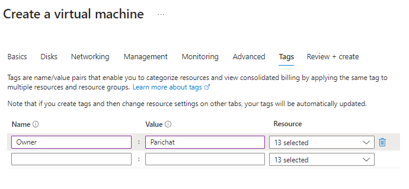

# How to create Virsual Machine on Azure
## Git Bash
### Generate SSH key
1) Open git bash
2) Navigate to home directory 
```bash
cd
```
3) Create a directory for SSH key
```bash
mkdir .ssh
```
4) Navigate into the .shh directory
5) Create a keypair
```bash
ssh-keygen -t rsa -b 4096 -C <email>
```
6) Give file a name 
7) Get public key
```bash
cat <file_name>.pub
```

## Azure Portal
1) Navigate to SSH Keys and *create* (it's best practice to have the key the same name as on local machine)
2) Select *upload existing public key*
3) Copy and paste the public key from Git Bash
4) Review and create  

## Create a virtual machine
select create > Azure virtual machine


### Create a virtual Machine > Basics

1) create **virtual machine name**  
2) **image:** select *Ubuntu Pro 18.04 LTS - x64 Gen2* >
3) **size**: *Standard_B1s*


4) Username: *adminuser*
5) SSH public *key source: Use existing key stored in Azure*
6) Stored key: *select key that stored in Azure*
7) Public inbound ports: *Allow selected ports*
8) Select inbopund ports: *select HTTP(80) and SSH(22)*


### Create a virtual Machine > Disks

change OS disk type: *Standard SSD*
 


### Create a virtual Machine > Networking

change Subnet: *default*


### Create a virtual Machine > Tags

add Name: *Owner*
add Value: *Parichat*



### Create a virtual Machine > Review + create
Use this page to review and check everything before create a virtual machine


